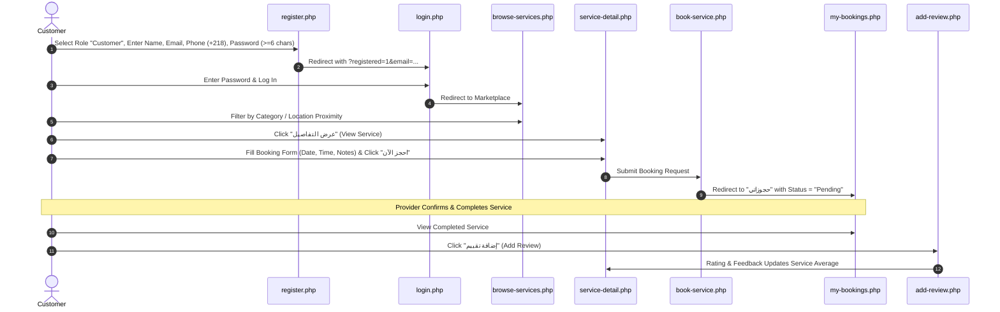
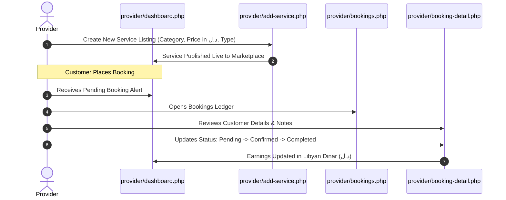

# 📁 Project Structure & Architectural Overview
## Local Service Connector System (Dabberha - دبرها)
### Comprehensive Academic Graduation Project Documentation

---

## 1. Executive Summary & Project Introduction

The **Local Service Connector System** (branded as **Dabberha / دبرها**) is a full-stack web application designed to connect local customers seeking home and professional maintenance services (such as plumbers, electricians, tutors, car mechanics, cleaners, and painters) with verified local service providers.

The platform operates on a **Three-Tier Multi-Role Architecture**:
1. **Customers (الزبائن)**: Can browse services, search by keyword, filter by category, calculate proximity recommendations, book services, track booking statuses, and leave verified ratings/reviews.
2. **Service Providers (مقدمو الخدمات)**: Can register their professional profile, publish and manage their service listings, set pricing in Libyan Dinar (`د.ل`), view booking requests, update service lifecycle statuses, and track revenue.
3. **Administrators (مديرو النظام)**: Maintain platform governance by managing service categories and icons, moderating services and reviews, overseeing user accounts, and monitoring global activity.

---

## 2. Directory Tree & File Inventory

Below is the complete inventory of all files and folders currently in the project:

```
local-services-platform/
│
├── config/
│   ├── db.php                          # Database PDO connection configuration
│   └── schema.sql                      # SQL database schema and sample seed data
│
├── assets/
│   ├── css/
│   │   └── theme.css                   # Design system tokens, custom scrollbars, RTL styling
│   └── js/
│       └── main.js                     # Global client-side interactivity & UI handlers
│
├── includes/
│   ├── auth.php                        # Session management & Role-Based Access Control (RBAC)
│   ├── translations.php                # Bilingual translation dictionary (Arabic / English)
│   ├── notifications.php               # System notification helper functions
│   ├── footer.php                      # Legacy footer compatibility wrapper
│   │
│   ├── helpers/
│   │   └── ui_helpers.php              # UI rendering helpers (badges, stars, alerts, icons)
│   │
│   ├── components/
│   │   ├── head.php                    # Centralized HTML <head>, Tailwind & MD3 design tokens
│   │   ├── navbar_public.php           # Unified top navigation bar for public & customer views
│   │   ├── footer_public.php           # Unified rich footer for public & customer views
│   │   ├── header_dashboard.php        # Unified top navigation header for Admin & Provider
│   │   └── sidebar.php                 # Responsive navigation sidebar for Admin & Provider
│   │
│   └── db/
│       ├── users_db.php                # Database queries for user accounts & profiles
│       ├── categories_db.php           # Database queries for service categories
│       ├── services_db.php             # Database queries for service listings
│       ├── bookings_db.php             # Database queries for bookings & status workflows
│       └── reviews_db.php              # Database queries for customer ratings & reviews
│
├── admin/
│   ├── dashboard.php                   # Admin analytics overview, statistics & KPI cards
│   ├── categories.php                  # Category management (Create, Read, Delete, FA Icons)
│   ├── services.php                    # Service listing management and moderation
│   ├── bookings.php                    # Global booking records and status management
│   ├── reviews.php                     # Review moderation and customer feedback oversight
│   └── users.php                       # User account management (activate, suspend, delete)
│
├── provider/
│   ├── dashboard.php                   # Provider KPI overview (earnings, bookings, rating)
│   ├── my-services.php                 # Provider's service catalog & price listings
│   ├── add-service.php                 # New service creation form with price in LYD (د.ل)
│   ├── edit-service.php                # Service update form
│   ├── bookings.php                    # Provider booking requests list
│   ├── booking-detail.php              # Detailed booking view, customer contact & status update
│   ├── reviews.php                     # Customer reviews and feedback received by provider
│   ├── profile.php                     # Provider profile, phone (+218), and service location
│   ├── header.php                      # Provider header layout wrapper
│   └── sidebar.php                     # Provider sidebar layout wrapper
│
├── public/
│   ├── login.php                       # Authentication portal with legacy password upgrade
│   ├── register.php                    # Interactive registration with role switcher & validation
│   ├── register-admin.php              # Administrator account registration portal
│   ├── logout.php                      # Secure session termination & logout script
│   ├── browse-services.php             # Service catalog, search, category filter & recommendation
│   ├── service-detail.php              # Service page with dynamic category icon & booking form
│   ├── book-service.php                # Booking processing controller
│   ├── booking-confirmation.php        # Booking confirmation receipt
│   ├── my-bookings.php                 # Customer portal (All, Upcoming, and Past bookings)
│   └── add-review.php                  # Interactive star rating & review submission form
│
├── index.php                           # Homepage (Hero, Categories, Value Proposition)
├── REFACTORING_PLAN.md                 # Architecture refactoring plan
├── PROJECT_STRUCTURE.md                # General project structure documentation
└── TECHNICAL_GUIDE.md                  # In-depth technical guide & code explanation
```

---

## 3. Detailed File-by-File Functional Breakdown

### 3.1 Configuration Layer (`config/`)
- **`config/db.php`**: Establishes the centralized database connection using PHP Data Objects (`PDO`). Connects to MySQL on port `3307` (or default `3306`), sets the UTF-8 character encoding (`utf8mb4`), and configures PDO error mode to throw exceptions (`PDO::ERRMODE_EXCEPTION`) for robust error handling.
- **`config/schema.sql`**: Contains the Data Definition Language (DDL) scripts to create all database tables (`users`, `categories`, `services`, `bookings`, `reviews`, `notifications`), primary keys, foreign key constraints, and seed data.

---

### 3.2 Core Includes & Business Logic (`includes/`)
- **`includes/auth.php`**: The security kernel of the application. Handles session initialization (`session_start()`), authentication verification (`isLoggedIn()`), identity extraction (`getUserId()`, `getUserRole()`, `getUserName()`), and route guarding (`requireLogin()`, `requireRole($role)`).
- **`includes/translations.php`**: Centralized localization dictionary. Implements the `__($key)` helper function to support dynamic bilingual switching between Arabic and English.
- **`includes/notifications.php`**: Contains helper functions for triggering, storing, and fetching in-app notifications.
- **`includes/footer.php`**: Backward-compatible footer file redirecting to modern components.

---

### 3.3 Reusable Layout Components (`includes/components/`)
- **`includes/components/head.php`**: Renders the complete HTML `<head>` tag. Loads Google Fonts (`Tajawal`), FontAwesome 6, Google Material Symbols, Tailwind CSS CDN with Material Design 3 design tokens (Terracotta theme `#95442b`, `#fff8f6`), and custom RTL select positioning.
- **`includes/components/navbar_public.php`**: Renders the top navigation header for public visitors and customer users. Displays dynamic branding, navigation links ("الرئيسية", "تصفح الخدمات", "التصنيفات"), and dynamic authentication buttons (Login / Register / User profile badge / My Bookings / Logout).
- **`includes/components/footer_public.php`**: Renders a rich 4-column footer containing platform branding, quick navigation links, provider onboarding links, trust & security badges, and copyright notices.
- **`includes/components/header_dashboard.php`**: Centralized top navbar for the Admin and Provider dashboards. Shows active role badge, user greeting, and logout button.
- **`includes/components/sidebar.php`**: Responsive sidebar navigation for both Admin and Provider panels. Dynamically highlights the active menu item based on current URL parameters.

---

### 3.4 Data Access Layer (`includes/db/`)
*Separates SQL queries completely from presentation templates to adhere to DRY and clean architecture:*
- **`includes/db/users_db.php`**: Manages all user queries (`getUserById`, `getUserByEmail`, `createUser`, `updateUserProfile`, `updateUserPassword`, `updateUserStatus`, `deleteUser`). Implements automatic bcrypt password hashing.
- **`includes/db/categories_db.php`**: Manages category data (`getAllCategories`, `getCategoryById`, `createCategory`, `deleteCategory`, `getCategoryCount`).
- **`includes/db/services_db.php`**: Manages service catalog queries (`getAllServices`, `getServiceById`, `getServicesByProvider`, `getServicesByCategory`, `createService`, `updateService`, `deleteService`).
- **`includes/db/bookings_db.php`**: Manages booking records (`getCustomerBookings`, `getProviderBookings`, `getAllBookings`, `createBooking`, `updateBookingStatus`, `getTotalEarnings`).
- **`includes/db/reviews_db.php`**: Manages reviews and rating aggregations (`getReviewsByService`, `getReviewsByProvider`, `getReviewByBookingId`, `createReview`, `getAverageRating`).

---

### 3.5 UI Helpers (`includes/helpers/`)
- **`includes/helpers/ui_helpers.php`**: Shared UI rendering functions:
  - `renderAlert($msg, $type)`: Renders dismissible alert banners.
  - `renderStatusBadge($status)`: Renders status pills (pending, confirmed, completed, cancelled) with dedicated colors.
  - `renderStarRating($rating, $max)`: Generates star rating visuals.
  - `renderEmptyState($icon, $title)`: Displays friendly empty-state illustrations when no data exists.
  - `getCategoryFAIcon($cat_name, $icon)`: Maps category names to FontAwesome icon classes.

---

### 3.6 Public & Customer Interface (`public/` & root `index.php`)
- **`index.php`**: Landing page featuring a hero section, value proposition badges, interactive category cards, "How It Works" workflow steps, and customer testimonials.
- **`public/browse-services.php`**: Marketplace catalog. Features live search, category filter dropdown, geolocation distance calculation, recommendation scoring (rating weight + distance proximity), and responsive service cards.
- **`public/service-detail.php`**: In-depth service listing page. Displays dynamic category icon configured by admin, provider contact info, price in Libyan Dinar (`د.ل`), customer reviews, and the booking form.
- **`public/book-service.php`**: Backend booking processor validating input parameters and persisting new booking entries.
- **`public/booking-confirmation.php`**: Digital booking receipt displaying service summary, provider details, booking date/time, and price in `د.ل`.
- **`public/my-bookings.php`**: Customer personal portal. Features status filter tabs ("All", "Upcoming", "Past"), status badges, total price, and triggers for review submission on completed jobs.
- **`public/add-review.php`**: Review and star-rating submission form for completed services.
- **`public/login.php`**: Authentication portal with role validation, pre-filled email on registration redirect, and automatic legacy plaintext password upgrading.
- **`public/register.php`**: User registration portal with interactive card-based role selection ("عميل" / "مزود خدمة"), real-time 6-character password validation, Libyan phone format (`+218`), and direct login redirection.
- **`public/register-admin.php`**: Secure administrative user registration page.
- **`public/logout.php`**: Terminates sessions safely and redirects to homepage.

---

### 3.7 Service Provider Portal (`provider/`)
- **`provider/dashboard.php`**: Provider management dashboard displaying 4 KPI summary cards (Total Bookings, Pending Bookings, Total Earnings in `د.ل`, Average Star Rating), pending booking request table, and recent customer reviews.
- **`provider/my-services.php`**: Lists all services published by the logged-in provider with edit/delete controls and pricing.
- **`provider/add-service.php`**: Allows providers to add a new service specifying category, title, description, price in `د.ل`, and price type (fixed / hourly).
- **`provider/edit-service.php`**: Form to edit existing service listings.
- **`provider/bookings.php`**: Table of all booking orders assigned to this provider with customer details and status filters.
- **`provider/booking-detail.php`**: Detailed view of a specific booking order with customer phone, address, notes, and status update form with RTL select.
- **`provider/reviews.php`**: List of all customer ratings and feedback received by the provider.
- **`provider/profile.php`**: Personal and business profile management (Full Name, Phone with `+218`, City/Location).

---

### 3.8 Administrator Control Panel (`admin/`)
- **`admin/dashboard.php`**: System oversight dashboard displaying high-level statistics (Total Users, Total Providers, Active Services, Total Bookings, Platform Revenue).
- **`admin/categories.php`**: Category manager allowing admins to create, view, and delete categories, assigning custom FontAwesome icons.
- **`admin/services.php`**: Global service directory to monitor and delete inappropriate listings.
- **`admin/bookings.php`**: Global booking ledger with inline status update controls and deletion tools.
- **`admin/reviews.php`**: Review moderation page to remove abusive or spam ratings.
- **`admin/users.php`**: User management table to view registered accounts, toggle account statuses (active / suspended), and delete users.

---

## 4. User Interaction & Workflow Maps

### 4.1 Customer Lifecycle: From Registration to Review



---

### 4.2 Provider Lifecycle: Listing Services to Fulfilling Bookings



---

## 5. User Roles and Permission Matrix

| Feature / Page | Public / Guest | Customer | Service Provider | Administrator |
| :--- | :---: | :---: | :---: | :---: |
| Browse Homepage (`index.php`) | ✅ | ✅ | ✅ | ✅ |
| Browse Marketplace (`browse-services.php`) | ✅ | ✅ | ✅ | ✅ |
| View Service Details (`service-detail.php`) | ✅ | ✅ | ✅ | ✅ |
| Book a Service (`service-detail.php`) | ❌ (Redirects to Login) | ✅ | ❌ | ❌ |
| Customer Bookings (`my-bookings.php`) | ❌ | ✅ | ❌ | ❌ |
| Leave Service Review (`add-review.php`) | ❌ | ✅ | ❌ | ❌ |
| Provider Dashboard (`provider/dashboard.php`) | ❌ | ❌ | ✅ | ❌ |
| Manage Provider Services (`provider/my-services.php`)| ❌ | ❌ | ✅ | ❌ |
| Manage Booking Orders (`provider/bookings.php`) | ❌ | ❌ | ✅ | ❌ |
| Admin Dashboard (`admin/dashboard.php`) | ❌ | ❌ | ❌ | ✅ |
| Manage Categories & Icons (`admin/categories.php`)| ❌ | ❌ | ❌ | ✅ |
| Moderate Services & Users (`admin/users.php`) | ❌ | ❌ | ❌ | ✅ |

---

## 6. How to Run and Deploy the Project Locally

### Prerequisites
1. **PHP**: Version 8.0 or higher with `pdo_mysql` extension enabled.
2. **Web Server**: Apache (via XAMPP, WampServer, or Laragon).
3. **Database**: MySQL 5.7+ or MariaDB 10.4+.

### Installation Steps
1. **Copy Files**: Place the project folder in your web server root:
   - XAMPP: `C:\xampp\htdocs\local-services-platform`
   - Custom: `D:\ps\htdocs\local-services-platform`
2. **Start Services**: Open XAMPP Control Panel and start **Apache** and **MySQL**.
3. **Import Database**:
   - Open PHPMyAdmin (`http://localhost/phpmyadmin` or `http://localhost:3307/phpmyadmin`).
   - Create a database named `local_services_db` with collation `utf8mb4_unicode_ci`.
   - Import the `config/schema.sql` file.
4. **Configure Database Connection**:
   - Open `config/db.php`.
   - Verify `$host = '127.0.0.1'`, `$port = '3307'` (or `'3306'`), `$user = 'root'`, and `$pass = ''`.
5. **Access the Application**:
   - Open your browser and navigate to:
     ```
     http://localhost/local-services-platform/index.php
     ```
   - **Default Admin Account**: `admin@localhost.com` / Password: `password` (or register via `register-admin.php`).
   - **Default Provider Account**: `saharma221@gmail.com` / Password: `password`.
   - **Default Customer Account**: `saharma20021@gmail.com` / Password: `password`.
