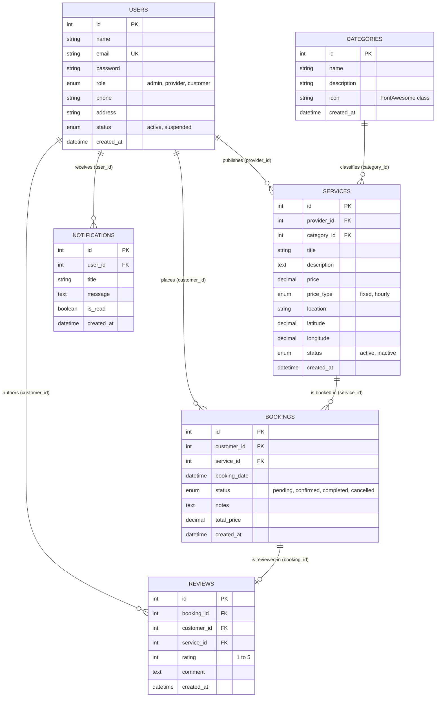
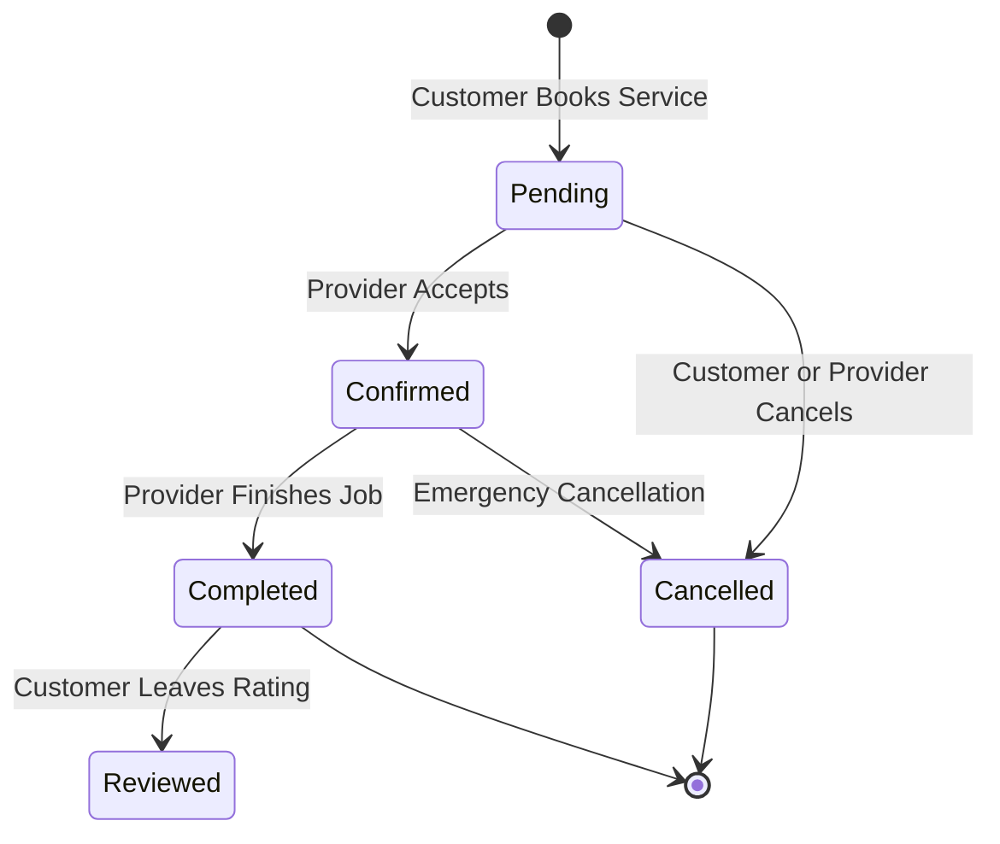

# 💻 Technical Architecture & Code Implementation Guide
## Local Service Connector System (Dabberha - دبرها)
### Academic Technical Report & Implementation Manual

---

## 1. Technology Stack & Integration Architecture

The **Local Service Connector System** is engineered using a robust, multi-layered web architecture designed for security, scalability, and high responsiveness:

| Technology Layer | Tool / Library | Version / Source | Architectural Role |
| :--- | :--- | :--- | :--- |
| **Backend Language** | PHP | 8.0+ | Server-side runtime, business logic, session handling, authentication |
| **Database Engine** | MySQL / MariaDB | 5.7+ / 10.4+ | Relational data persistence, foreign key integrity, indexation |
| **Data Access Layer** | PHP Data Objects (PDO) | Core PHP | Parameterized queries, prepared statements, SQL injection defense |
| **Styling Framework** | Tailwind CSS (v3 CDN) | CDN | Responsive utility classes, modern CSS grid, flexbox layout |
| **Design System Tokens** | Material Design 3 (MD3) | Custom Config | Warm Terracotta palette (`#95442b`, `#fff8f6`), typography scale |
| **Icons & Visuals** | FontAwesome 6 + Google Material | CDN | Category icons, status pills, action buttons, rating stars |
| **Typography** | Google Fonts (`Tajawal`) | CDN | High-legibility Arabic & Latin typography |
| **Client-side Scripting** | Vanilla JavaScript (ES6+) | Native Browser | Real-time form validation, interactive role cards, DOM manipulation |

---

## 2. Database Schema & Relational Integrity

The relational database `local_services_db` is normalized into **6 primary tables**. Foreign keys guarantee referential integrity across all entities:



### Table Definitions & Foreign Key Constraints

1. **`users` Table**:
   - `id`: Primary key (Auto Increment).
   - `email`: Unique identifier used for authentication.
   - `password`: Securely hashed password string (Bcrypt hash `$2y$...`).
   - `role`: Enum (`customer`, `provider`, `admin`) driving system-wide RBAC.
   - `phone`: Contact phone number formatted to Libyan standard (`+218`).
   - `status`: Enum (`active`, `suspended`) allows admins to ban malicious accounts.

2. **`categories` Table**:
   - `id`: Primary key.
   - `name`: Category name in Arabic/English (e.g., "تنظيف منازل", "ميكانيكا سيارات").
   - `icon`: FontAwesome class string chosen by admin (e.g., `fa-solid fa-broom`, `fa-solid fa-car-side`, `fa-solid fa-faucet-drip`).

3. **`services` Table**:
   - `provider_id`: Foreign key referencing `users(id)` ON DELETE CASCADE.
   - `category_id`: Foreign key referencing `categories(id)` ON DELETE SET NULL.
   - `price`: Price in Libyan Dinar (`د.ل`) stored as `DECIMAL(10,2)`.
   - `price_type`: Enum (`fixed`, `hourly`).
   - `latitude` / `longitude`: Coordinates used in the Haversine distance proximity algorithm.

4. **`bookings` Table**:
   - `customer_id`: Foreign key referencing `users(id)` ON DELETE CASCADE.
   - `service_id`: Foreign key referencing `services(id)` ON DELETE CASCADE.
   - `status`: Enum (`pending`, `confirmed`, `completed`, `cancelled`).
   - `total_price`: Historical price snapshot in `د.ل` at the moment of booking.

5. **`reviews` Table**:
   - `booking_id`: Foreign key referencing `bookings(id)` ON DELETE CASCADE.
   - `rating`: Integer constraint between `1` and `5`.
   - `comment`: Customer feedback text.

---

## 3. Core PHP Architecture & Critical Functions

### 3.1 Parameterized PDO Database Connection (`config/db.php`)
```php
<?php
$host = '127.0.0.1';
$port = '3307';
$db   = 'local_services_db';
$user = 'root';
$pass = '';

try {
    $pdo = new PDO("mysql:host=$host;port=$port;dbname=$db;charset=utf8mb4", $user, $pass);
    // Throw exceptions on error to prevent silent data failure
    $pdo->setAttribute(PDO::ATTR_ERRMODE, PDO::ERRMODE_EXCEPTION);
} catch (PDOException $e) {
    die("Database Connection Error: " . $e->getMessage());
}
?>
```

---

### 3.2 Authentication & Role-Based Access Control (`includes/auth.php`)
The system secures pages using strict server-side session checks:

```php
<?php
if (session_status() === PHP_SESSION_NONE) {
    session_start();
}

function isLoggedIn(): bool {
    return isset($_SESSION['user_id']) && !empty($_SESSION['user_id']);
}

function getUserRole(): string {
    return $_SESSION['user_role'] ?? '';
}

function requireLogin(): void {
    if (!isLoggedIn()) {
        header('Location: /local-services-platform/public/login.php');
        exit;
    }
}

function requireRole(string $required_role): void {
    requireLogin();
    if (getUserRole() !== $required_role) {
        // Unauthorized access -> redirect to appropriate home
        header('Location: /local-services-platform/index.php');
        exit;
    }
}
?>
```

---

### 3.3 Secure Password Hashing & Legacy Auto-Upgrade (`includes/db/users_db.php` & `public/login.php`)

To prevent storing plaintext credentials, password creation uses PHP's native `password_hash()` with the Bcrypt algorithm:

```php
// In includes/db/users_db.php:
function createUser(array $data): int {
    global $pdo;
    $raw_password = (string)($data['password'] ?? '');
    
    // Automatically hash using Bcrypt if raw password provided
    $password_info = password_get_info($raw_password);
    $hashed_password = ($password_info['algo'] === 0) 
        ? password_hash($raw_password, PASSWORD_DEFAULT) 
        : $raw_password;

    $stmt = $pdo->prepare("
        INSERT INTO users (name, email, password, role, phone, address, status)
        VALUES (?, ?, ?, ?, ?, ?, ?)
    ");
    $stmt->execute([
        trim($data['name']),
        trim($data['email']),
        $hashed_password,
        $data['role'] ?? 'customer',
        trim($data['phone'] ?? ''),
        trim($data['address'] ?? ''),
        $data['status'] ?? 'active'
    ]);
    return (int)$pdo->lastInsertId();
}
```

#### Dual Verification & Auto-Upgrade Logic in `public/login.php`:
```php
$user = getUserByEmail($email);
$is_password_valid = false;

if ($user && $user['status'] === 'active') {
    if (password_verify($password, $user['password'])) {
        $is_password_valid = true;
    } elseif ($password === $user['password']) {
        // Legacy plaintext password detected -> Verify and immediately upgrade to Bcrypt
        $is_password_valid = true;
        updateUserPassword((int)$user['id'], $password);
    }
}
```

---

### 3.4 Smart Recommendation & Search Algorithm (`public/browse-services.php`)

The platform implements a multi-criteria scoring algorithm that ranks service providers based on **Customer Ratings** and **Geographical Proximity (Haversine Formula)**:

$$\text{Distance (km)} = 2 R \cdot \arcsin\left(\sqrt{\sin^2\left(\frac{\Delta\text{lat}}{2}\right) + \cos(\text{lat}_1)\cos(\text{lat}_2)\sin^2\left(\frac{\Delta\text{lon}}{2}\right)}\right)$$

```php
// Proximity Calculation Function:
function calculateDistance($lat1, $lon1, $lat2, $lon2) {
    $earthRadius = 6371; // Earth radius in Kilometers
    $dLat = deg2rad($lat2 - $lat1);
    $dLon = deg2rad($lon2 - $lon1);
    $a = sin($dLat / 2) * sin($dLat / 2) +
         cos(deg2rad($lat1)) * cos(deg2rad($lat2)) *
         sin($dLon / 2) * sin($dLon / 2);
    $c = 2 * atan2(sqrt($a), sqrt(1 - $a));
    return $earthRadius * $c;
}

// Composite Recommendation Score:
// 60% Rating Weight + 40% Proximity Weight
$rating_score = ($avg_rating / 5.0) * 0.6;
$distance_score = max(0, (1 - ($distance_km / 50.0))) * 0.4;
$recommendation_score = $rating_score + $distance_score;
```

---

### 3.5 Booking Lifecycle State Machine (`includes/db/bookings_db.php`)

Each booking transitions through discrete, authorized states:



---

## 4. Security Architecture & Threat Mitigation

| Security Domain | Potential Threat | Mitigation Implemented in Codebase |
| :--- | :--- | :--- |
| **Database Security** | SQL Injection (SQLi) | **Prepared Statements with PDO**: Zero string interpolation in SQL queries. All parameters bound via `$stmt->execute([...])`. |
| **Output Encoding** | Cross-Site Scripting (XSS) | **Contextual Escaping**: All user inputs rendered in HTML are sanitized through `htmlspecialchars($str, ENT_QUOTES, 'UTF-8')`. |
| **Credential Storage** | Password Data Leaks | **Bcrypt Hashing**: Passwords stored using `password_hash()` with standard work factor. |
| **Access Control** | Broken Object Level Auth (BOLA) | **RBAC Middleware**: `requireRole('provider')` and `requireRole('admin')` enforce strict role verification on every route. |
| **Data Integrity** | Invalid Account States | **Database Constraints**: Foreign keys with `CASCADE` or `SET NULL` maintain referential integrity. |

---

## 5. UI/UX & Responsive Design System

1. **RTL Directional Precision**:
   - The entire platform defaults to Arabic Right-To-Left (`dir="rtl"`).
   - Global dropdown select arrow positioning is inverted to the left using CSS overrides in `assets/css/theme.css`:
     ```css
     [dir="rtl"] select, html[dir="rtl"] select, select {
         background-position: left 0.75rem center !important;
         padding-left: 2.5rem !important;
         padding-right: 1rem !important;
         text-align: right;
     }
     ```
2. **Standardized Currency Formatting**:
   - Currency is consistently rendered in Libyan Dinar: `<?php echo number_format($price, 2); ?> د.ل`.
3. **Dynamic Category Icons**:
   - Replaced hardcoded static symbols with dynamic FontAwesome classes chosen by the administrator from the database (`categories.icon`).
